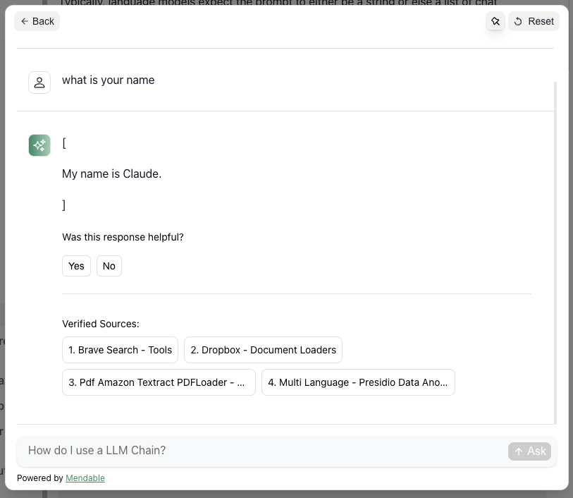

# 스케줄
>2023-11-22 ~ 2023-11-28
* demo 키워드 삭제  @김정민 @이성욱
    * 100% 완료
* 스웨거를 이용한 백엔드 도큐멘테이션 작업 @김정민
    * 50% (컨트롤러 완료, 엔티티, 서비스(할지말지?)) 
* 파이썬 도큐멘테이션 작업 @이성욱
    * 30% (sphinx로 내용이 만들어지지 않는 문제 해결 필요)
* 소스 리팩토링
    * 10% (추후 천천히 개발하면서 보완하는 것으로 결정)

>2023-11-29 ~ 2023-12-05
* 위의 버전으로 관리자용 UI정의서 만들기 @이성욱  
* 위의 버전으로 사용자용 UI정의서 만들기 @김정민  
    * 참고 (https://python.langchain.com/docs/modules/model_io/prompts/prompt_templates/#lcel)
* 3개의 repository 추가 (aifredManageBackend, aifredManageFrontend, aifredCommon) @이성욱 
* 초기화 aifredManageBackend @이성욱
* 초기화 aifredManageFrontend @김정민
* 초기화 aifredCommon @이성욱

### 아래와 같은 내용의 클라이언 필요

목록
-
* 챗봇 팝업 (가제)

## 관리자 화면은 어떻게?

프로세스를 생각해보자.

회사내 문서 위치를 등록 polling -> 변경된 내용이 있으면 다시 읽어서 db에 반영 
회사내 문서를 개별등록도 가능 (이 경우 polling하지 않는다)

문서 레파지토리 목록을 관리하는 화면이 필요 

목록
- 
>문서 레파지토리 관리 화면
* 레파지토리 명세 관리 (문서의 저장소 위치들을 관리하는 명세 화면)
* 레파지토리 상세 관리 (레파지토리 명세화면에서 단건을 선택시 오픈되는 상세 관리 화면)
* 스케줄러 관리
* 스케줄러 프로세스 이력 조회
    * 추가적인 화면 고민 필요

* 문서 명세 관리 (프로세스 처리후 문서들의 목록과 처리 결과등을 확인하는 화면)
* 문서 상세 관리 (명세에서 선택한 항목에 대한 상세 조회 - vectorDB 조회 포함)
* 문서 메타 관리 (운영단에서 관리할 항목이 아닌 셋업시에만 관리할 항목이라면 별도의 화면이 아닌 설정 파일로 관리하는 것도 고려)

* 프롬프트 명세 관리 (프롬프트 자체에 대한 관리)
* 프롬프트 상세 관리 (프롬프트 자체에 대한 관리)
* Intent 관리
* 프롬프트-Intent 연결 관리 (프로그램 상에서 수정이 필요한 부분으로 보임- 관리화면에서 설정 가능하도록 고민 필요)

* 대화 프로세스 관리(X) ( 현재로서는 QA 형태의 프로세스로 고정, 추후 업무프로세스를 설정할 수 있도록 할것인지.. 고민 필요)

